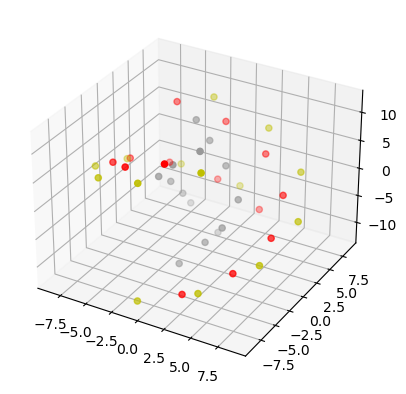
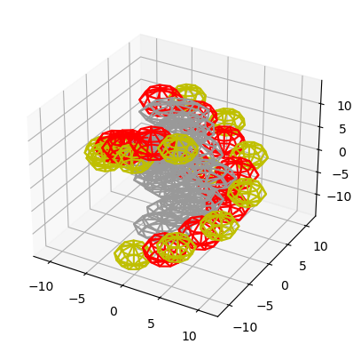

Getting Started with DNA Models
===============================

This is a guide that explores how the Fractal DNA module works to make DNA models.
It complements the example notebooks found in :doc:`Examples <examples>`.


Step 1: What this module does and doesn't do
--------------------------------------------

Fractal DNA was built to enable researchers to build models of DNA easily in Python.
It's aim is to take a few general types of DNA structure and make them accessible
in Python in a 'building-block' style form, so that multiple segments can be
joined together to make larger DNA sections.

It was originally built to provide the raw data that powered Geant4 simulations of
radiation-induced DNA damage.

The aim is to allow users to build straight and turned sections of DNA that are either
entirely unpacked, or packed as chromatin. When denser DNA is needed, the program
allows up to 9 parallel DNA segments of DNA to be generated (depending on the packing).

It then allows a researcher to export the sugar, phosphate and base pair locations needed
for simulation.

It was not intended to export the locations of every single atom within DNA, though you
might be able to extend the package towards this with some hackery.

It was not intended to export the locations in a format that is adapted to arbitrary
modelling or simulation platforms, *however*, you should be able to take the output
this package provides and then transform it to your needs.

Step 2: Great, let's make some DNA
----------------------------------

Once you've got fractaldna installed (`pip install fractaldna`), it's time
to make some DNA. The interface for making DNA is very simple, it takes a base
pair sequence, written as a string, and then builds the DNA chain corresponding
to that sequence.

So let's imagine you want to replicate the sequence `GATTACA`, you would want to call

```.py
from fractaldna.dna_models import dnachain
chain = dnachain.DNAChain('GATTACA') 
```

This will make a DNA Chain 7 base pairs long. Note that in the above, we imported the
`dnachain` submodule. This is where all of the routines to build DNA segments live.

You can plot this DNA chain pretty easily, by calling:

```.py
fig = chain.to_plot()
fig.savefig('docs/source/images/gattaca_plot.png', bbox_inches='tight')
```

Which will produce the below figure:



Yellow shows the locations of phosphate molecules, red shows the location of
sugar molecules, and grey shows where the base pairs are.

Depending on what you want to plot, this basic plot might not give you enough
detail about what is going on. You can also generate a surface plot which shows
the rough surface of these DNA molecules:

```.py
fig = chain.to_surface_plot()
fig.savefig('docs/source/images/gattaca_plot_surface.png', bbox_inches='tight')
```




DNA basepairs are in general 3.32Å apart, so if you want to generate a DNA strand
100nm long, the way to do this is to work out the number of basepairs that you
need, and then generate a chain that is long enough.

```
from fractaldna.dna_models import dnachain
import numpy as np
bp_separation  = dnachain.BP_SEPARATION  # 3.32Å
length_nm = 100  # nm
num_basepairs = int( length_nm / (0.1*bp_separation) )
basepairs = np.random.choice(['G', 'A', 'T', 'C'], num_basepairs)

chain = dnachain.DNAChain(''.join(basepairs))
```

Step 3: Straight DNA is great and all, but I want more variety
--------------------------------------------------------------

So you have worked out by now how to make a DNA chain from a
collection of base pairs. Now you want to generate, let's say,
a curved section of DNA. That's easy:

```.py
from fractaldna.dna_models import dnachain
chain = dnachain.DNAChain('GATTACA'*100) 
```

(to be continued)