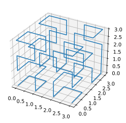
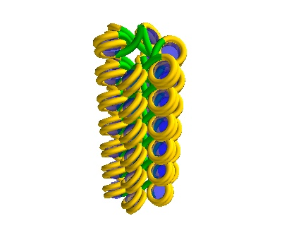

.. FractalDNA documentation master file, created by
   sphinx-quickstart on Sun Oct 10 15:09:58 2021.
   You can adapt this file completely to your liking, but it should at least
   contain the root `toctree` directive.
   

FractalDNA
==========

FractalDNA is a Python package to make DNA geometries that can be joined together like
jigsaw puzzles. Both simple, sections of DNA and Solenoidal DNA can be built. This
module was built to enable DNA-level simulations to be run in `Geant4-DNA <http://geant4-dna.in2p3.fr/>`_, part of the
`Geant4 <geant4.cern.ch/>`_ project.

:doc:`Structure models <structure_models>` define the large scale structure of DNA,
seeded from fractals. An example seeding fractal is below:

:doc:`DNA Models <dna_models>` provide straight and curved segments that can come together to
make DNA for use in simulations.

Documentation is divided into three main sections, focused on :doc:`building DNA models <dna_models>`,
:doc:`high level structure models <structure_models>`, and then some notebook  :doc:`examples <examples>`. showing
how the code works.

.. toctree::
   :maxdepth: 1

   structure_models
   dna_models
   examples
   api

Indices and tables
==================

* :ref:`genindex`
* :ref:`modindex`
* :ref:`search`
